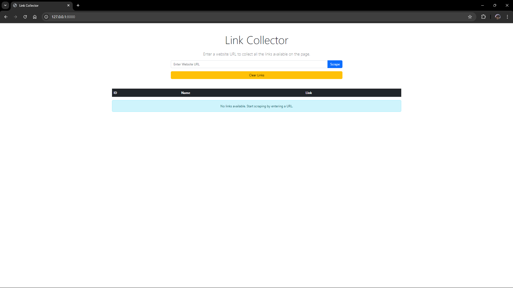
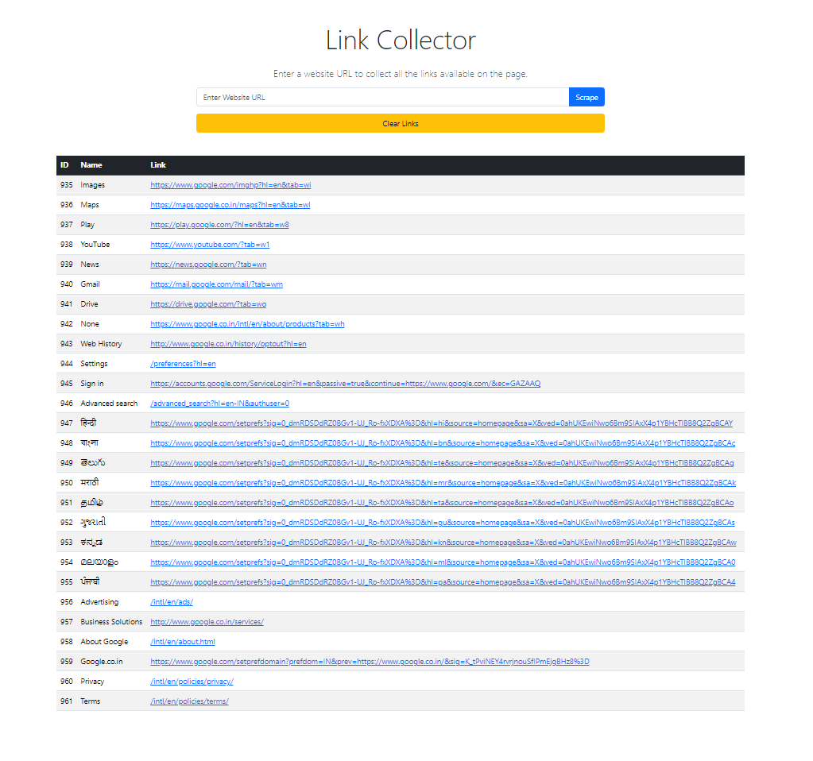

# Django-Web-Scraper

# Link Collector

**Link Collector** is a Django-based web scraper application that allows users to input a website URL and retrieve all the available links from the page. The collected links are displayed in a simple, user-friendly interface, where users can view and directly access the links. This project demonstrates how to integrate Python, Django, and web scraping techniques into a functional and efficient web application.

## Features:
- **URL Input Form**: Users can enter any valid website URL to collect its links.
- **Link Display**: Extracted links are displayed in a table, with direct clickable access.
- **Error Handling**: Alerts users with descriptive error messages if the scraping fails.
- **Link Management**: Option to clear all collected links with a single click.
- **Responsive Design**: Clean and responsive interface built using Bootstrap.

## Screenshots:

1. **Home Page and Input Form**  
   

2. **Scraped Links Table**  
   

## Technologies Used:
- **Backend**: Django, Python
- **Frontend**: Bootstrap 5, HTML, CSS
- **Web Scraping**: Python's `requests` and `BeautifulSoup` libraries
- **Database**: SQLite (default Django configuration)

## Installation and Setup:

1. Clone the repository:
  - git clone https://github.com/yourusername/link-collector.git
  - cd link-collector

2. Install dependencies:
   - pip install -r requirements.txt

3. Run database migrations:
   - python manage.py migrate

4. Start the server:
   - python manage.py runserver

5. Access the app at http://127.0.0.1:8000/

## How It Works:

1. Enter a valid website URL in the input form.
2. The app scrapes the webpage for all hyperlinks.
3. The links are displayed in a table with IDs, names, and clickable URLs.
4. Use the "Clear Links" button to delete all previously scraped links.

